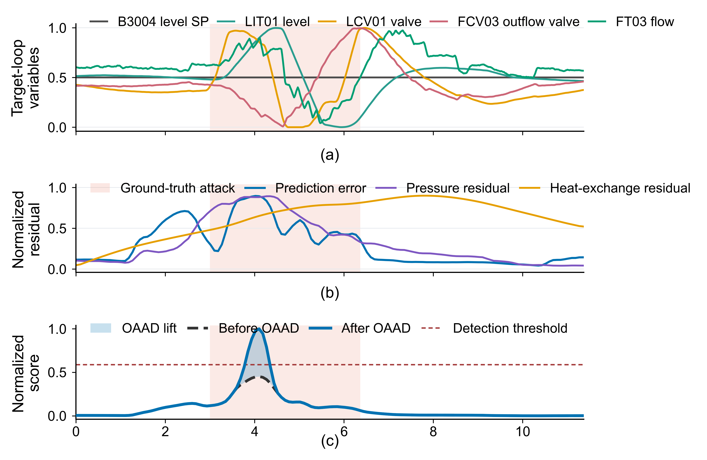

# PI-STGAD on the HAI 21.03 Benchmark

Data preparation, experiment configuration, method workflow, and case-study
analysis for PI-STGAD on the HAI 21.03 benchmark.

## Overview

This repository provides the HAI 21.03 materials accompanying PI-STGAD,
including data preparation, experiment configuration, method-workflow
documentation, process-graph topology, and scripts for a representative HAI
case-study analysis.

The public materials organize the data-processing procedure, experimental
setup, process topology, and case-study analysis into a coherent and directly
inspectable workflow, with executable scripts for data preparation,
case-study generation, and release validation.

## HAI Dataset

HAI 21.03 is a public industrial-control-system security benchmark collected
from a hardware-in-the-loop augmented testbed. PI-STGAD uses the P1 boiler
process, sampled at 1 Hz, to study anomaly detection under normal-operation
training and attack-scenario testing.

Download HAI 21.03 from the
[official dataset repository](https://github.com/icsdataset/hai/tree/master/hai-21.03)
and place the files under:

```text
data/
└── hai-21.03/
    ├── train1.csv
    ├── train2.csv
    ├── train3.csv
    └── test5.csv
```

The CSV files remain under the terms and distribution channels of the dataset
maintainers and are not copied into this repository. See
[`data/README.md`](data/README.md) for the expected layout.

Dataset reference: H.-K. Shin, W. Lee, J.-H. Yun, and B.-G. Min, “Two ICS
Security Datasets and Anomaly Detection Contest on the HIL-Based Augmented ICS
Testbed,” *Cyber Security Experimentation and Test Workshop*, pp. 36–40,
2021, [doi:10.1145/3474718.3474719](https://doi.org/10.1145/3474718.3474719).

## Experiment Configuration

The HAI configuration is separated into three inspectable files:

- [`configs/hai_data_schema.json`](configs/hai_data_schema.json) defines the
  17 graph inputs, nine operational-context variables, filtering,
  normalization, window construction, and one-step prediction target.
- [`configs/hai_graph.json`](configs/hai_graph.json) records the fixed
  process-connectivity graph used for the P1 boiler variables.
- [`configs/hai_test5_case.json`](configs/hai_test5_case.json) records the
  seed, selected case interval, figure annotation, and output settings.

The case uses a 120-s input window and a 5-s test stride. Sensor normalization
is fitted on `train1.csv`–`train3.csv`, which contain normal-operation data.
The experiment configuration also records the seed, epoch count, batch size,
learning rate and schedule, representation dimensions, physics-loss weight,
dropout, and early-stopping patience used for the HAI study.

## Method Workflow

The released HAI materials follow this analysis path:

```text
HAI process data
        ↓
data preparation and normalization
        ↓
17-node graph-window construction
        ↓
temporal representation and topology-aware aggregation
        ↓
operational-context-conditioned one-step prediction
        ↓
prediction-error and physics-residual evidence
        ↓
OAAD score enhancement
        ↓
representative HAI case-study analysis
```

[`docs/hai_workflow.md`](docs/hai_workflow.md) explains the role, inputs,
outputs, and public files associated with each stage.

## Repository Structure

```text
PI-STGAD-HAI/
├── README.md
├── requirements.txt
├── .gitignore
├── .gitattributes
├── configs/
│   ├── hai_test5_case.json
│   ├── hai_data_schema.json
│   └── hai_graph.json
├── docs/
│   └── hai_workflow.md
├── scripts/
│   ├── prepare_hai_inputs.py
│   ├── reproduce_hai_case_figure.py
│   └── validate_release.py
├── artifacts/
│   ├── README.md
│   └── hai_case_artifact_seed42.npz
├── assets/
│   └── hai_case_reference.png
└── data/
    └── README.md
```

## Environment

The public workflow was tested with Python 3.12.4 and the dependency versions
recorded in `requirements.txt`:

```bash
python -m pip install -r requirements.txt
```

The scripts use NumPy, pandas, SciPy, and Matplotlib. A GPU is not required for
the data-preparation, case-analysis, or validation commands in this repository.

## Data Preparation

From the repository root, prepare the P1 inputs from the official HAI files:

```bash
python scripts/prepare_hai_inputs.py --hai-root data/hai-21.03
```

The script selects the configured P1 variables, applies the sensor filter,
fits per-variable min–max normalization on the three normal-operation training
files, and constructs the 120-s graph and operational-context windows used by
the selected case. It also prepares the next-step process-value target. The
model-input construction does not load per-sample attack-label columns.

## Case-Study Analysis

Generate the representative HAI diagnostic case:

```bash
python scripts/reproduce_hai_case_figure.py
```

The case study illustrates how process context, prediction-error evidence,
physics-informed residual evidence, and OAAD-based score enhancement are
combined in the PI-STGAD analysis. Panel (a) shows target-loop process
variables and operational context, panel (b) shows prediction-error and
physics-residual evidence, and panel (c) compares score responses before and
after OAAD enhancement.

## Expected Output

The case-analysis command writes:

```text
outputs/
├── hai_case_study.pdf
├── hai_case_study.svg
└── hai_case_study.png
```

<p align="center">
  
</p>

The shaded interval identifies the selected HAI case for visual reference.
The figure presents a diagnostic example and does not characterize every HAI
attack scenario.

## Release Validation

After data preparation and figure generation, run:

```bash
python scripts/validate_release.py
```

The validation checks the repository layout, JSON configuration, graph and
input dimensions, case-artifact fields, array alignment, generated outputs,
reference-image agreement, and Git exclusions for raw data and generated
files. It does not calculate benchmark performance metrics.

## Data and Code Availability

Materials associated with non-public industrial data are not included because
the data are subject to confidentiality restrictions.
